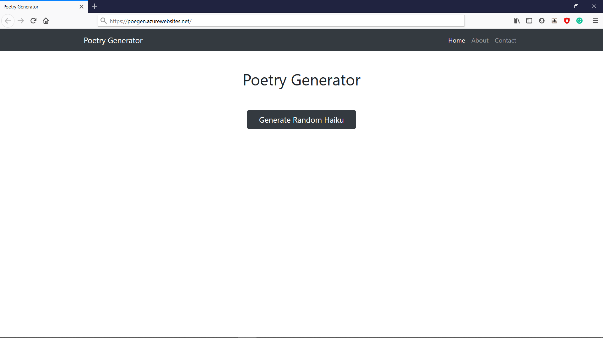
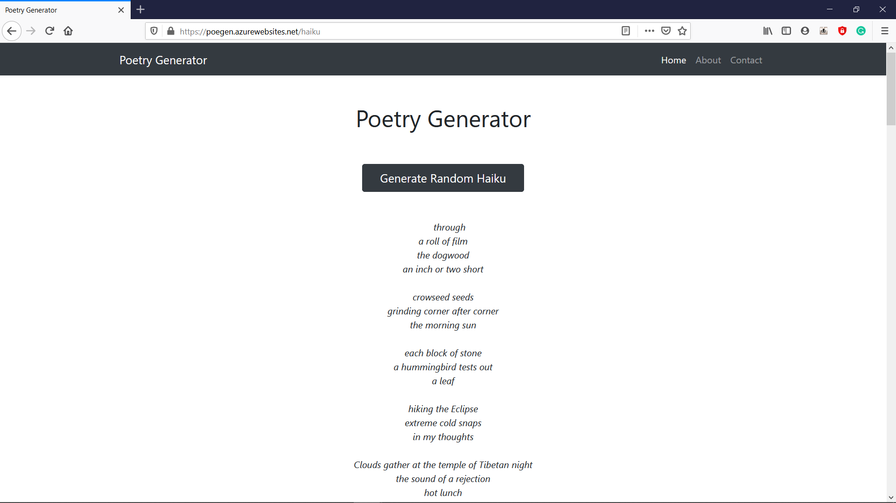

## WebApp to generate Poetry using OpenAI's GPT-2 model


Website - https://poegen.azurewebsites.net/ (*may or may not work*)

<h3 align = "center">Home Page</h3>



---
<h3 align = "center">Generating Samples</h3>



---
<h3> Data Used</h3>

The Data used to train the model can be found in [this repo](https://github.com/docmarionum1/haikurnn/)

### Haiku generated by the model (That are acutually good)

```
a double rainbow
blooming past
the cemetery
```
```
rising mist
the sound of hoofs
on the grass
```


## Reference and Code Used
[Ng Wai Foong's Medium Blog](https://medium.com/@ngwaifoong92/beginners-guide-to-retrain-gpt-2-117m-to-generate-custom-text-content-8bb5363d8b7f)

[Brian Weeteling's Blog](https://www.brianweet.com/2019/06/16/write-ai-gpt-2-haiku.html)

[Openai's GPT-2 Model](https://github.com/openai/gpt-2)

[N Shepperd's GPT-2 Fork](https://github.com/nshepperd/gpt-2)
